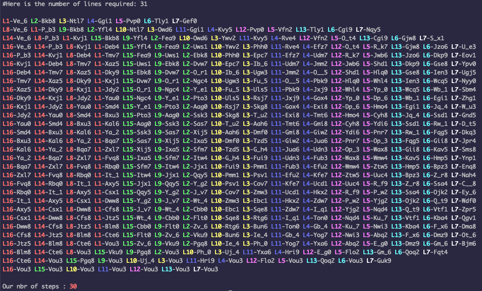

# Lem-in
Graph Algorithm Project @ 42

Lem-in is an algorithmic project that relies on graph theory. The aim is to 
find the shortest and quickest solution for a number of ants to traverse an 
ant colony (the graph) from the source node to the sink node in the least 
amount of steps.
We will need to find the shortest paths or paths to achieve this.
For this project, I used an adaptation of the Edmund-Karp algorithm 
(based on the Ford-Fulkerson algorithm).

Input:
- number of ants
- the rooms (vertex)
- the links (edges)

Output:
- the input
- the solution (paths + nbr of steps)

The constraints:

- An ant can only move once per turn.
- A vertex can only contain one ant (except the source and the sink).
- The program must take less than 3 seconds. Therefore the algorithm has to 
avoid trafic jam and overlapping.

## Usage

git clone https://github.com/MathieuJouffroy/Lem-in.git && cd Lem-in && make

./lem-in < maps/[map_name]

#### Map example

It's graphical representation 

Comments "##start" and '##end' indicates the sink and source node respectively.
They must be linked together (graph traversal).

## Example

